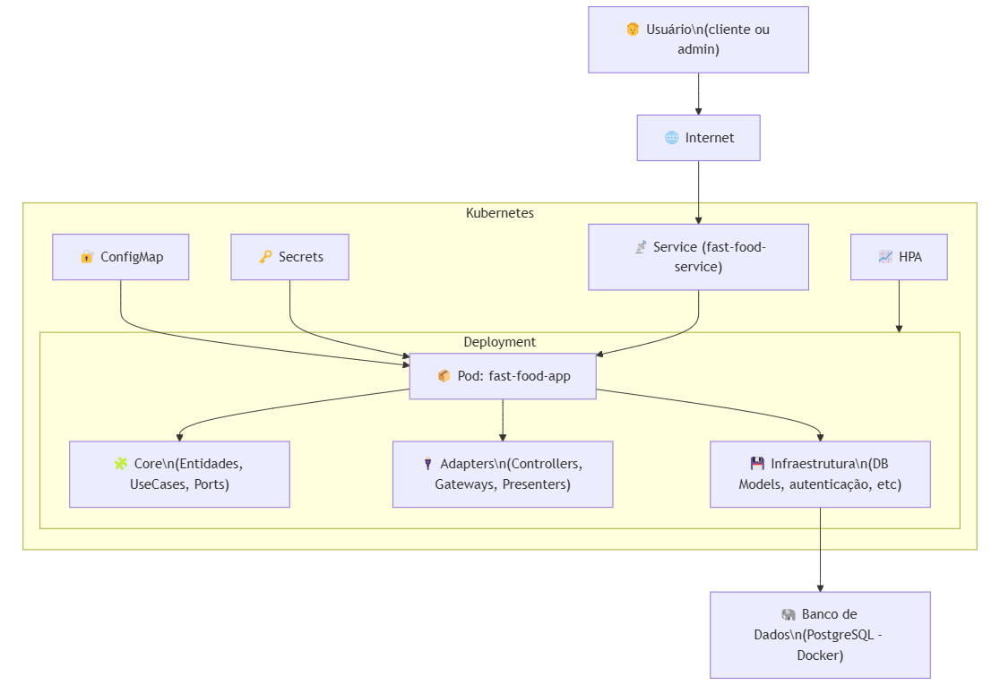

# Tech Challenge - Fast Food Self-Service

Este projeto faz parte de um Tech Challenge, que envolve a criação de um sistema de autoatendimento para uma lanchonete em expansão. A ideia é permitir que os clientes façam pedidos de forma rápida e prática, enquanto o estabelecimento consegue gerenciar de forma eficiente produtos, clientes e pedidos.

---

## 1. Visão Geral do Problema (Requisitos de Negócio)

A lanchonete está crescendo rapidamente, mas sem um sistema de controle de pedidos, o atendimento pode se tornar confuso e ineficiente:

- **Risco de erros** ao anotar manualmente os pedidos  
- **Perda de tempo** com pedidos confusos ou esquecidos  
- **Clientes insatisfeitos** devido a atrasos e falhas de comunicação  

Para resolver esse problema, o projeto propõe um sistema de autoatendimento com as seguintes etapas:

1. **Pedido**  
   - Cliente pode se identificar (CPF, nome, e-mail) ou permanecer anônimo  
   - Montagem do combo (lanche, acompanhamento, bebida e sobremesa – todos opcionais)  
   - Exibição de nome, descrição e preço de cada produto  

2. **Pagamento**  
   - Integração de pagamento via QRCode do Mercado Pago (MVP)  

3. **Acompanhamento**  
   - Monitor para o cliente acompanhar o progresso do pedido:  
     - *Recebido* → *Em preparação* → *Pronto* → *Finalizado*  

4. **Entrega**  
   - Notificação de pedido pronto para retirada  
   - Ao retirar, o pedido é marcado como *Finalizado*  

Além disso, o acesso administrativo permite:
- Gerenciar clientes (para campanhas promocionais)
- Gerenciar produtos (nome, categoria, preço, descrição e imagens)
- Acompanhar pedidos em andamento (tempo de espera, status, etc.)

---

## 2. Desenho de Arquitetura (Requisitos de Infraestrutura)

Abaixo está um desenho conceitual simples da arquitetura proposta. Ele contempla tanto a parte de aplicação (FastAPI + Banco de Dados) quanto os componentes de infraestrutura (Docker Desktop Kubernetes, clusters, etc.).



1. **Kubernetes Cluster**  
   - Usamos o Kubernetes nativo do Docker Desktop para orquestração dos contêineres.  
   - Permite escalabilidade caso o fluxo de pedidos cresça e haja necessidade de rodar múltiplas réplicas do serviço.

2. **FastAPI Application**  
   - Aplicação principal responsável pelo backend, escrita em Python + FastAPI.  
   - Exposta por meio de um *Deployment* + *Service* (tipo NodePort ou LoadBalancer, dependendo do ambiente).  
   - Contém toda a lógica de negócio (CRUD de clientes, produtos, pedidos, etc.).

3. **PostgreSQL**  
   - Banco de dados responsável por armazenar usuários, produtos e pedidos.  
   - Pode ser executado como um *StatefulSet* no Kubernetes para garantir o estado (se o projeto exigir alta disponibilidade) ou em um *Pod* simples em cenários de desenvolvimento.  
   - Para ambientes locais ou de desenvolvimento simples, ainda é possível usar `docker-compose` em paralelo.

---

## 3. Estrutura do Projeto

- **main.py**: Ponto de entrada da aplicação (FastAPI).
- **app/**: Diretório principal da aplicação, contendo regras de negócio, adaptadores, configurações e entidades.
  - **adapters/**: Camada que conecta o domínio da aplicação ao mundo externo (API, gateways, etc.).
  - **core/**: Contém entidades, schemas, ports e casos de uso (usecases).
  - **devices/**: Responsável pela comunicação com o banco de dados e modelos SQLAlchemy.
  - **shared/**: Utilitários e componentes compartilháveis (enums, validadores, mixins).
- **migrations/**: Diretório do Alembic para controle de versão do schema do banco de dados.
- **tests/**: Estrutura de testes automatizados (unitários, integração e e2e).
- **k8s/**: Arquivos de configuração para deploy em Kubernetes.
- **Dockerfile**: Define a imagem Docker da aplicação.
- **docker-compose.yaml**: Orquestração de serviços para ambiente local (app + banco de dados).

---

## 4. Configuração com Docker Compose (Cenário de Desenvolvimento Obrigatório)

Embora o objetivo final seja rodar em Kubernetes, **é obrigatório** garantir que o projeto suba localmente via Docker Compose para desenvolvimento mais simples e padronizado.

1. **Pré-requisitos**  
   - Docker instalado ([Download Docker](https://www.docker.com/))  
   - Docker Compose (geralmente incluso no Docker Desktop ou no pacote docker-cli em Linux)

2. **Arquivo `.env`**  
   Crie um arquivo `.env` na raiz do projeto com as variáveis de ambiente do banco e outras que precisar, por exemplo:

   ```text
   DB_HOST=db
   DB_PORT=5432
   DB_USER=postgres
   DB_PASSWORD=mysecretpassword
   DB_NAME=fastfood
   ```
   O Docker Compose lê esse arquivo e injeta as variáveis nos contêineres.

3. **Subir os Contêineres**  
   Na raiz do projeto, rode:

   ```bash
   docker compose up --build
   ```
   Isso vai:  
   - Construir a imagem do aplicativo FastAPI  
   - Iniciar o contêiner web (FastAPI/Uvicorn) e o contêiner db (Postgres)  
   - Mapear as portas definidas no `docker-compose.yaml`  
   - Carregar as variáveis de ambiente do `.env`  

4. **Verificar a Aplicação**  
   - Abra [http://localhost:8000](http://localhost:8000) para acessar a aplicação.  
   - A documentação automática (Swagger) estará em [http://localhost:8000/docs](http://localhost:8000/docs).  

> **Observação**: Se você tiver um Postgres local rodando na porta `5432`, pode ocorrer conflito. Ajuste a porta no `docker-compose.yaml` (por exemplo `5433:5432`), mas mantenha `DB_PORT=5432` no contêiner para não quebrar a comunicação interna.

---

## 5. Como Utilizar o Alembic (Migrações)

O Alembic é a ferramenta de migração do SQLAlchemy que permite versionar alterações no schema do banco de dados.

### 5.1 Criar/Revisar Migrações

```bash
docker compose run web alembic revision --autogenerate -m "Descrição da mudança"
```
Isso executa o contêiner `web` e gera um script de migração em `migrations/versions/`.

### 5.2 Aplicar Migrações

```bash
docker compose run web alembic upgrade head
```
Assim, o banco de dados no contêiner `db` refletirá as últimas alterações de schema.

### 5.3 Exemplo de Reversão

```bash
docker compose run web alembic downgrade -1
```
Reverte a última migração aplicada.

**Importante**:
- Não use `Base.metadata.create_all(bind=engine)` no código para criar ou atualizar tabelas. Essa responsabilidade é do Alembic.  
- Se estiver usando `.env`, certifique-se de que as variáveis (como `DB_HOST`, `DB_PORT`, etc.) estejam alinhadas com o `env.py` do Alembic (ou você pode sobrescrevê-las via `config.set_main_option("sqlalchemy.url", ...)`).

---

## 6. Execução com Kubernetes (usando Docker Desktop ou KIND)

Caso você não queira utilizar o Minikube, há outras opções para rodar Kubernetes localmente, como:
- **Docker Desktop** (ativando o Kubernetes integrado)
- **KIND** (Kubernetes IN Docker)

Abaixo, segue um guia rápido usando **Kubernetes do Docker Desktop** como exemplo.

### 6.1. Ativar o Kubernetes no Docker Desktop
1. Abra o Docker Desktop.
2. Vá em **Settings** → **Kubernetes**.
3. Marque "Enable Kubernetes" e aguarde até que o cluster esteja pronto.

### 6.2. Verificar o cluster
```bash
kubectl cluster-info
kubectl get nodes
```
Se houver um nó em status `Ready`, o cluster está funcional.

### 6.3. Criar os recursos Kubernetes
Na raiz do projeto:
```bash
kubectl apply -f k8s/configmap.yaml
kubectl apply -f k8s/secrets.yaml
kubectl apply -f k8s/deployment.yaml
kubectl apply -f k8s/service.yaml
kubectl apply -f k8s/hpa.yaml
```

### 6.4. Acessar a aplicação
Por padrão, se o `Service` estiver definido como **ClusterIP**, você só poderá acessá-lo de dentro do cluster. Duas abordagens comuns:

- **Port-Forward**:
  ```bash
  kubectl port-forward service/fast-food-service 8080:80
  ```
  Acesse em `http://localhost:8080`.

- **NodePort**:
  Se você alterar o tipo do Service para `NodePort`, o Kubernetes atribuirá uma porta no host. Verifique a porta:
  ```bash
  kubectl get svc
  ```
  e acesse `http://localhost:<nodePort>`.

Em ambos os casos, a documentação Swagger estará em `/docs`.

---

## Banco de Dados (fora do cluster)

O banco de dados **não está dentro do cluster Kubernetes**. Ele roda separadamente via **Docker Compose**:

```bash
docker compose up db
```

> Certifique-se de que a aplicação no Kubernetes consiga acessar o IP do seu host Docker (ou `host.docker.internal`, se estiver no Windows/Mac) e que `DB_HOST` esteja apontando corretamente.

### Variáveis de ambiente importantes (em `.env` ou ConfigMap/Secrets)
```
DB_HOST=host.docker.internal  # ou IP real do host
DB_PORT=5432
DB_USER=postgres
DB_PASSWORD=mysecretpassword
DB_NAME=fastfood
```

---

## 7. Conclusão

Este README cobre:

1. **Requisitos de Negócio** e como o sistema de autoatendimento resolve o problema de confusão e ineficiência em pedidos.  
2. **Desenho de Arquitetura** com Docker Desktop Kubernetes para escalabilidade, usando FastAPI e PostgreSQL.  
3. **Como rodar localmente** via Docker Compose, que é a forma obrigatória para facilitar o desenvolvimento.  
4. **Gerenciamento de migrações** de banco de dados via Alembic.  
5. **Exemplo básico de deployment no Kubernetes**, caso opte por levar o projeto para um ambiente mais escalável.  
6. **Documentação**,  documentação Swagger estará em /docs.

Ao seguir esses passos, você terá o sistema de autoatendimento de Fast Food rodando em contêineres Docker, pronto para evoluir e atender às demandas do desafio – com a possibilidade de escalar em um cluster Kubernetes quando for necessário.

---

---